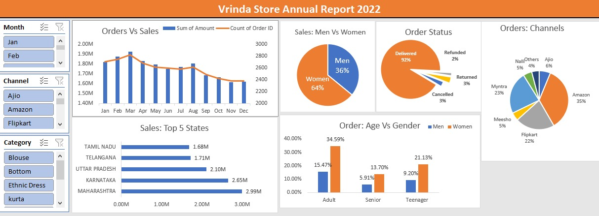

# Vrinda Store Data Insights

## Project Overview

This project involves analyzing sales data for "Vrinda Store" to gain insights into sales trends, customer demographics, and order distribution. The analysis was conducted using Microsoft Excel, with steps including data cleaning, transformation, and the creation of visualizations. A dashboard was designed to effectively present the findings, helping to identify key patterns and inform business decisions.

---

## Features

- **Data Cleaning**: Processed raw data to remove inconsistencies and improve readability.
- **Data Transformation**:
  - Extracted **Month** from date values.
  - Created an **Age Group** column based on customer ages.
- **Data Analysis**:
  - Used pivot tables to summarize key metrics.
  - Derived insights on **Sales by Gender**, **Sales by State**, **Orders by Channel**, and **Order Status**.
- **Visualization**:
  - Created graphs based on pivot tables.
  - Developed a dashboard to present key insights.

---

## Files Included

1. **Vrinda Store Dataset.xlsx** - Raw data file before processing.
2. **Vrinda Store Data Analysis.xlsx** - Cleaned data with pivot tables and analysis.
3. **Vrinda_Store_Report_dashboard.png** - Final dashboard summarizing the findings.

---

## Tools Used

- **Microsoft Excel** for:
  - Data cleaning and transformation
  - Pivot tables for summarization
  - Chart creation for visualization
  - Dashboard development for reporting

---

## Dashboard Preview

Below is a snapshot of the Excel Dashboard:

---

## Insights from the Dashboard
- **Sales Trends**: Monthly sales fluctuate, with peaks in March and May.
- **Gender-Based Sales**: Women contribute to 64% of total sales, while men contribute 36%.
- **Top 5 States**: Maharashtra leads in sales, followed by Karnataka and Uttar Pradesh.
- **Order Channels**: Amazon is the largest order source (35%), followed by Flipkart (22%) and Myntra (23%).
- **Order Status**: 92% of orders are successfully delivered, with minimal returns and cancellations.
- **Age Group Analysis**: Women in the adult age group (34.59%) contribute significantly to sales.

---

## How to Use

1. Open **Vrinda Store Dataset.xlsx** to view the raw data.
2. Check **Vrinda Store Data Analysis.xlsx** for cleaned and processed data.
3. Refer to **Vrinda_Store_Report_dashboard.png** for visual insights.

---

## Future Improvements

- Automate data updates using **Power Query**.
- Expand analysis with **Power BI or Tableau** for more dynamic reporting.
- Integrate additional datasets for deeper insights.

---

## License

This project is for educational and portfolio purposes. Feel free to explore and modify it!

